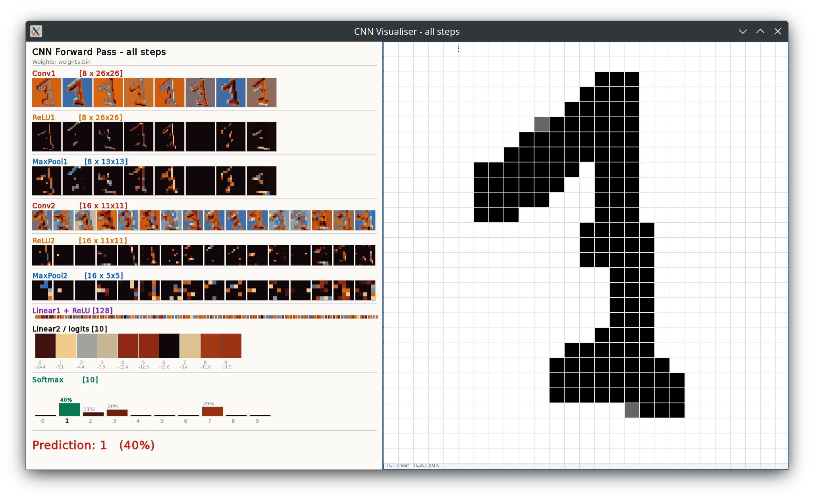

<p align="center">
  
</p>

# CNN from scratch - C++/CUDA

A convolutional neural network implemented entirely from scratch in C++ and CUDA. No ML framework, no cuDNN, no autograd. Every component - forward pass, backpropagation, Adam optimiser, and GPU kernels - is written by hand.

Trained on MNIST (60k images), evaluated on GPU with custom CUDA kernels. Includes a network graph visualiser that animates activations layer by layer during inference.

---

## Results

| | Time (10k images) | ms / image |
|---|---|---|
| CPU | 2 860 ms | 0.29 ms |
| GPU (batch 128) | 64 ms | 0.006 ms |
| **Speedup** | **44×** | |

Test accuracy: **~98%** after 5 epochs.

The dominant bottleneck was PCIe transfer overhead, not compute. Batching 256 images per transfer had more impact than kernel-level optimisation.

---

## Architecture

```
Input        1 × 28 × 28
Conv2D       1 → 8 filters, k=3        + ReLU
MaxPool      2×2
Conv2D       8 → 16 filters, k=3       + ReLU
MaxPool      2×2
Flatten      → 400
Linear       400 → 128                  + ReLU
Linear       128 → 10
Softmax
```

54 026 parameters total.

---

## Implementation

### Training (CPU)

- Forward pass through all layers
- Fused Softmax + Cross-Entropy loss (numerically stable)
- Backpropagation through Conv2D, MaxPool, ReLU, Linear
- Adam optimiser with per-layer moment buffers
- Weights serialised to binary for reuse

### Inference (GPU)

One CUDA kernel per operation:

| Kernel | Grid | Strategy |
|---|---|---|
| `conv2d_kernel` | `(B, C_out, spatial)` | One thread per output pixel |
| `relu_kernel` | `(elements / 256)` | In-place, one thread per element |
| `maxpool_kernel` | `(B, C, spatial)` | One thread per pooling window |
| `linear_kernel` | `(B, out_features)` | One thread per output neuron |
| `softmax_kernel` | `(B)` | One block per sample, shared memory reduction |

Weights uploaded once before the evaluation loop. Only images transfer per batch.

### Visualiser

Generates a frame-by-frame PNG sequence (and GIF via ffmpeg) of the network graph during a forward pass. Each layer renders as a column of nodes - Conv/Pool nodes display their feature map as a miniature heatmap, FC layers as a sampled dot column. Edges drawn for top-N activated connections, opacity proportional to `activation_src × activation_dst`.

---

## Project structure

```
├── include/
│   ├── tensor.h            N-D float tensor, flat storage
│   ├── layers.h            Conv2D, ReLU, MaxPool, Flatten, Linear, Softmax, Sequential
│   ├── mnist_loader.h      IDX binary parser + ASCII visualisation
│   ├── gpu_layers.h        GPUSequential, evaluate_gpu
│   └── visualizer.h        Network graph visualiser
├── src/
│   ├── main.cpp            Pipeline: train → evaluate CPU → evaluate GPU → visualise
│   ├── layers.cpp          Layer implementations + Adam + weight serialisation
│   ├── mnist_loader.cpp    MNIST loader
│   └── visualizer.cpp      PNG writer (no deps) + graph renderer + ffmpeg GIF
├── cuda/
│   ├── conv_kernel.cu
│   ├── relu_kernel.cu
│   ├── pool_kernel.cu
│   ├── fc_kernel.cu        Linear + Softmax kernels
│   └── gpu_layers.cu       GPUSequential + evaluate_gpu
├── data/                   MNIST IDX files (not tracked)
└── CMakeLists.txt
```

---

## Build

### CPU only

```bash
mkdir build
cd build
cmake ..
make -j$(nproc)
```


CMake auto-detects CUDA and compiles GPU kernels accordingly.

---

## Usage

```bash
# Train (5 epochs) + evaluate + visualise sample #0
./mnist_cnn

# Custom epochs and learning rate
./mnist_cnn 10 0.0005

# Evaluate only from saved weights, visualise sample #42
./mnist_cnn 0 0.001 weights.bin --eval 42

# Test it
./cnn_viewer
```


---

## Dependencies

- C++20
- CUDA 11+ (optional - GPU inference only)
- ffmpeg (optional - GIF assembly only)
- No external C++ libraries


<p align="center">
  
</p>